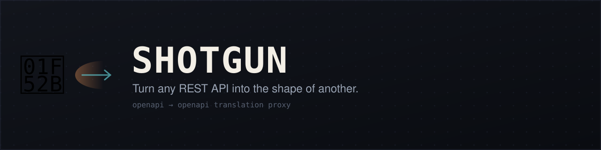

<p align="center">
  
</p>

# Shotgun

**Turn any REST API into the shape of another.**

Shotgun is a reverse proxy generator. Give it two OpenAPI specs—the API you want to *expose* and the upstream API you're actually calling—and it diffs them, auto-maps what lines up, and runs a proxy that translates requests and responses between the two shapes.

Two APIs in the same domain (Git forges, payment processors, CMS platforms) usually share 60-80% of their structure. Shotgun maps the obvious parts and leaves you a checklist for the rest.

## Quick start

```sh
cargo build --release
```

```sh
# 1. Diff two specs and generate a mapping file
shotgun init --source github-api.json --target forgejo-api.json --output mappings.toml

# 2. Review mappings.toml — fill in anything left as target = ""

# 3. Run the proxy
shotgun serve --mappings mappings.toml --target-url https://forgejo.example.com
```

When specs change, re-diff without losing your edits:

```sh
shotgun sync --source github-api-v2.json --target forgejo-api-v2.json --mappings mappings.toml
```

Check a mapping file for problems:

```sh
shotgun validate --mappings mappings.toml
```

## How matching works

Matching is **deterministic** — an endpoint or field either maps unambiguously or it doesn't. No scoring, no fuzzy similarity, no guessed renames. A wrong guess that looks confident is worse than an honest gap.

- **Endpoints** are matched by normalized path (`{param}` names are ignored) + HTTP method, then by `operationId`. Everything else is left unmapped for you.
- **Fields** are matched by exact name. Same name + compatible type = auto-mapped. Same name + incompatible type = flagged. Fields on only one side become `defaults` or `drops` — the todo list for adding renames.

Nested schemas (e.g. a `User` inside a `Repository`) are diffed once and reused everywhere they appear.

## The mapping file

`mappings.toml` is the actual product — everything else is plumbing. It's meant to be read, version-controlled, and hand-edited.

```toml
[[endpoints]]
source = "GET /repos/{owner}/{repo}"
target = "GET /repos/{owner}/{repo}"
# edited = true   # protects this entry from shotgun sync

  [endpoints.response.renames]
  # source_field = "target_field"

  [endpoints.response.defaults]
  node_id = ""   # source-only field with no target equivalent

  [endpoints.response.drops]
  # target-only fields to hide from source-API clients
```

Key concepts:
- **Renames** map source field names to target field names. Shotgun never writes these — every rename is something a human added.
- **`edited = true`** marks entries that `shotgun sync` should leave alone on re-diff.
- **`[[schemas]]`** define reusable field maps for named types referenced via `schema_map`.
- **`[settings]`** controls unmapped-endpoint behavior, base paths, and pagination handling.

## Status

Working core, not a finished product. OpenAPI 3.0/3.1 and Swagger 2.0 are supported.

## License

MIT
